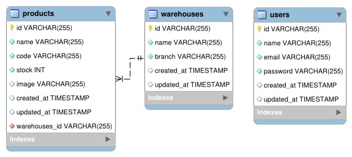
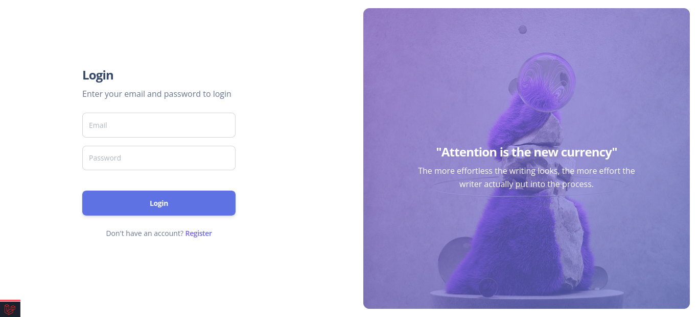
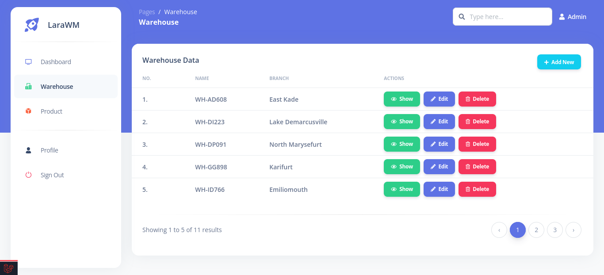
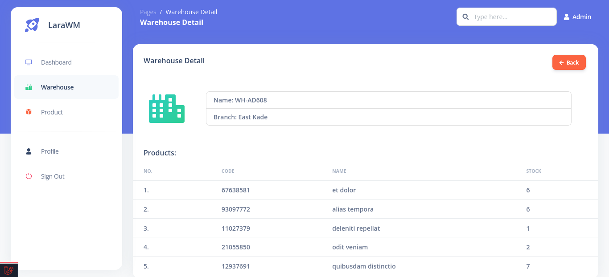
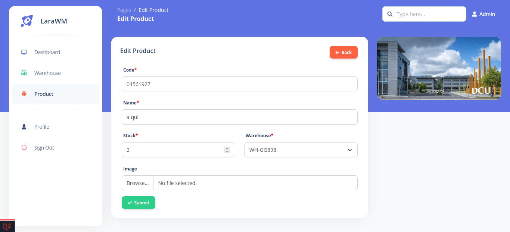

<p align="center"></p>

<h1 align="center">LaraWM</h1>

## Penjelasan Project

LaraWM adalah website untuk mengelola produk yang berada dalam suatu warehouse perusahaan logistik. Biasanya sebuah perusahaan memiliki beberapa warehouse yang didalamnya terdapat berbagai macam produk.

### Dokumentasi API
[https://documenter.getpostman.com/view/12352177/UzJFvdop](https://documenter.getpostman.com/view/12352177/UzJFvdop)

### Desain Database



### Screenshot Aplikasi






### Dependency

- **[Argon Dashboard](https://www.creative-tim.com/product/argon-dashboard)**

## Instalasi

1. Clone repository
    ```bash
    git clone https://github.com/harisfi/larawm.git
    ```

2. Gunakan package manager [composer](https://getcomposer.org/download/) untuk menginstall vendor.
    ```bash
    composer install
    ```

3. Gunakan package manager [npm](https://npmjs.com/) untuk mengkompilasi css.
    ```bash
    npm install && npm run dev
    ```

4. Konfigurasi file .env, => copy .env.example dan rename ke .env
    ```bash
    cp .env.example .env
    ```

5. Isi konfigurasi database di file .env

6. Buat APP_KEY
    ```bash
    php artisan key:generate
    ```

7. Jalankan Migration
    ```bash
    php artisan migrate
    ```

8. Jalankan Seeder
    ```bash
    php artisan db:seed
    ```

9. Buat symlink dari public/storage ke storage/app/public
    ```bash
    php artisan storage:link
    ```

10. Jalankan server Laravel
    ```bash
    php artisan serve
    ```

### Konfigurasi untuk deploy production

1. Ubah debug dalam .env
    ```bash
    APP_DEBUG=false
    ```

2. Jalankan printah artisan untuk optimasi
    ```bash
    php artisan optimize
    ```

## Contributing
Pull requests are welcome. For major changes, please open an issue first to discuss what you would like to change.

## License
[MIT](https://choosealicense.com/licenses/mit/)